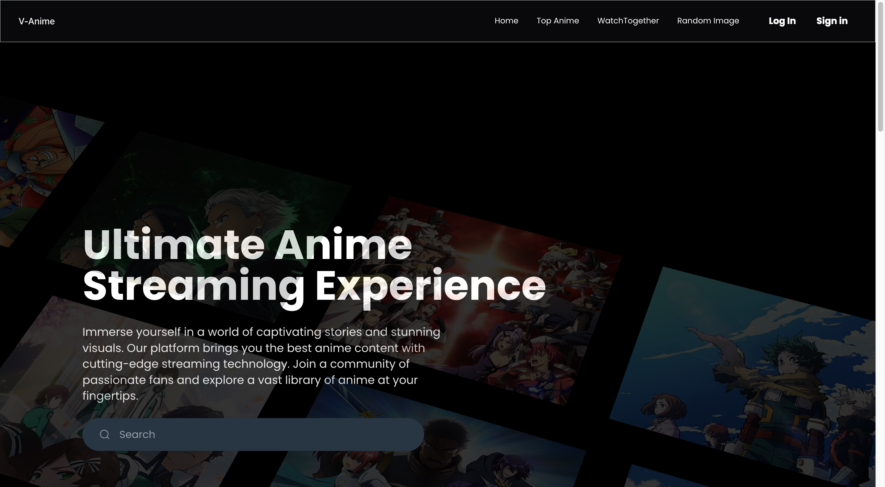
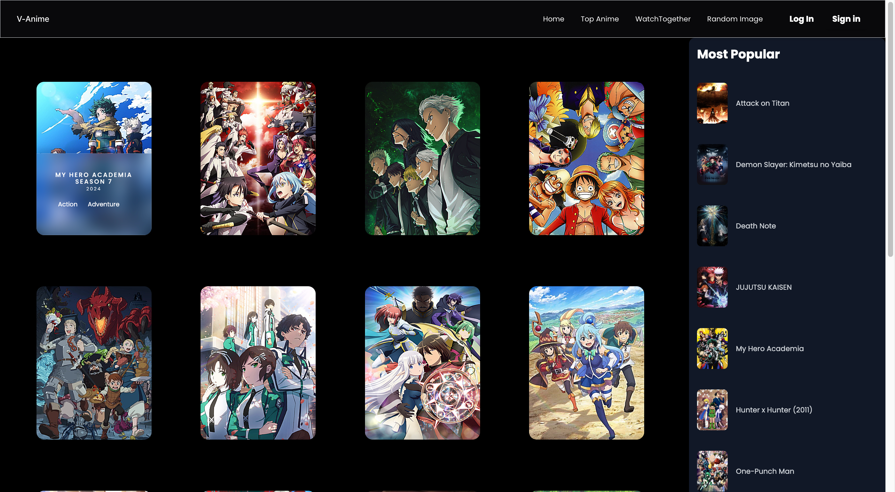
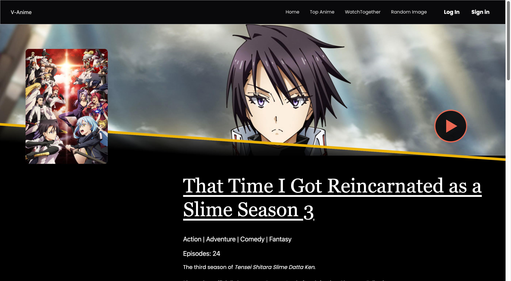

# V-Anime

Welcome to V-Anime, your ultimate destination for streaming anime content. Whether you're a seasoned otaku or just starting to explore the world of anime, V-Anime has something for everyone. With a vast collection of anime series, movies, and OVA's, you'll never run out of exciting content to watch.
 
 

  

 

## Features

- **Extensive Library**: Access thousands of anime titles across various genres, including action, romance, fantasy, sci-fi, and more.
- **Personalized Recommendations**: Our recommendation engine suggests anime based on your preferences and viewing history, helping you discover new favorites.
- **Offline Viewing**: Download your favorite anime episodes and movies to watch offline, perfect for long journeys or when you're without internet access.
- **Multiple Devices**: Enjoy V-Anime on your smartphone, tablet, laptop, or smart TV, and seamlessly switch between devices without losing your progress.
- **User-Friendly Interface**: Navigate through our app effortlessly with a clean and intuitive interface designed for anime enthusiasts of all levels.
- **Customizable Profiles**: Create multiple profiles for different users within your household, each with their own watch history and preferences.

## Screenshots
## Screenshots

Here are some screenshots of the V-Anime app:

  ### Home
  
  
  ### Search
  

  ### Details
  

  ### Watch
  

</a>

 
Thank you for choosing V-Anime. Happy streaming! 🎉  
Share With your friends.

  

